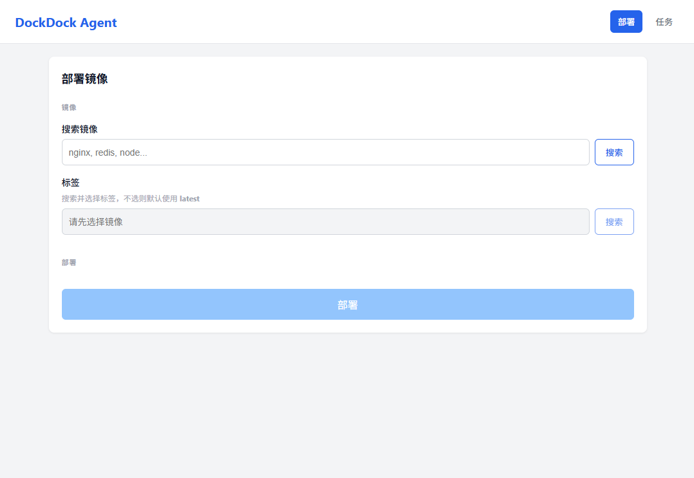

# DockDock Agent

DockDock Agent 是一个 Docker 镜像部署工具，专为无法正常拉取 Docker Hub 镜像的环境设计。

通过配合 [DockDock Server](https://github.com/Leskur/dockdock-server) 作为镜像代理，用户可以在网络受限的环境下搜索、下载并部署 Docker 镜像，全程通过 Web 界面操作，无需命令行。

## 特性

- 通过 DockDock Server 代理拉取镜像，解决 Docker Hub 访问失败问题
- 搜索镜像直接部署，无需手动 `docker pull` + `docker run`
- 单文件分发，服务器零依赖
- 一键安装，自动注册为系统服务

## 截图

<!-- TODO: 添加 Web 界面截图 -->


## 环境要求

- Linux x64 / arm64
- 已安装 Docker，且 `docker` 命令在 PATH 中可用

## 临时运行

无需安装，下载后直接运行即可体验：

```bash
# 下载并解压（以 x64 为例，arm64 请替换为 arm64）
curl -fSL https://github.com/Leskur/dockdock-agent/releases/latest/download/dockdock-agent-linux-x64.tar.gz -o dockdock-agent.tar.gz
tar -xzf dockdock-agent.tar.gz

# 直接运行
./dockdock-agent
```

Web 界面：`http://服务器IP:8910`

> 自定义端口：`PORT=9000 ./dockdock-agent`

## 一键安装

```bash
curl -fsSL https://raw.githubusercontent.com/Leskur/dockdock-agent/main/install.sh | bash
```

安装完成后自动注册为 systemd 服务并启动。

Web 界面：`http://服务器IP:8910`

> 如果无法直接访问 GitHub，可通过代理安装：`curl -fsSL https://raw.githubusercontent.com/Leskur/dockdock-agent/main/install.sh | https_proxy=http://127.0.0.1:7890 bash`

## 离线安装

如果服务器无法访问 GitHub，可通过其他设备下载压缩包和 [install.sh](https://raw.githubusercontent.com/Leskur/dockdock-agent/main/install.sh)，上传到服务器后用脚本安装：

```bash
# 传入本地压缩包路径作为参数
bash install.sh dockdock-agent-linux-x64.tar.gz
```

脚本会自动解压、安装二进制并注册为 systemd 服务。

## 卸载

```bash
curl -fsSL https://raw.githubusercontent.com/Leskur/dockdock-agent/main/uninstall.sh | bash
```

## 服务管理

```bash
systemctl status dockdock-agent    # 查看状态
systemctl restart dockdock-agent   # 重启
systemctl stop dockdock-agent      # 停止
journalctl -u dockdock-agent -f    # 查看日志
```
